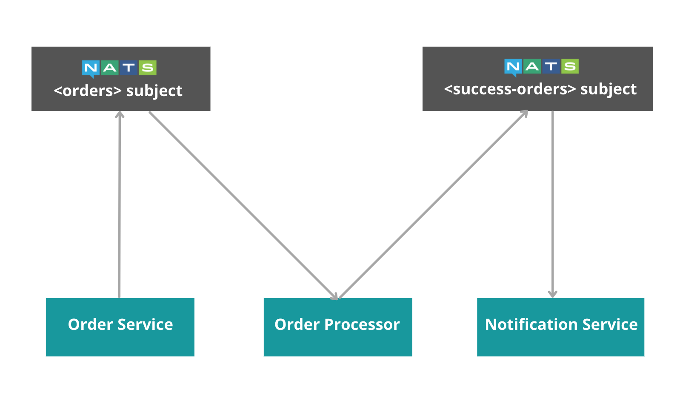

# Order Manager System

## Overview
This consists of 3 services.

- **Order Service** - An Http service with a NATS producer which publishes an order to a NATS subject when a request is received.
- **Order Processor** - A NATS listener which listens to the NATS subject and validates the order. If the order is successful, it is published to a new topic by a NATS producer.
- **Notification Service** - A NATS listener which listens to the successful orders and mocks sending a notification.

## Implementation



#### Setting Up NATS
1. [Install NATS in your local machine](https://docs.nats.io/running-a-nats-service/introduction/installation)
2. [Use NATS with docker](https://docs.nats.io/running-a-nats-service/introduction/installation)

## Run the Example

First, clone this repository, and then, run the following commands in the given order to run this example in your local machine. Use separate terminals for each step.

1. Run the Order Service.
```sh
$ cd examples/order-manager/order-service
$ bal run
```
2. Run the Order processor.
```sh
$ cd examples/order-manager/order-processor
$ bal run
```
3. Run the Notification service.
```sh
$ cd examples/order-manager/notification-service
$ bal run
```
4. Send a request to the order service with order details using `curl`.
```
curl -X GET "http://localhost:9090/nats/publish?message=PS5&status=SUCCESS" -u user:password
```
